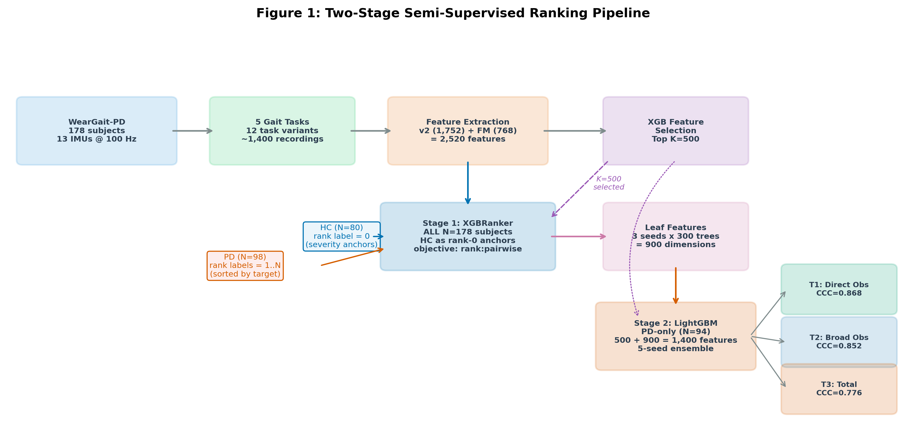

# Healthy-Control-Anchored Semi-Supervised Ranking Improves Calibration of Wearable Parkinson's Disease Motor Assessment

> **First UPDRS-III regression benchmark on WearGait-PD** — predicting Parkinson's motor severity from body-worn IMU sensors using healthy controls as calibration anchors.

## Key Results

We introduce a two-stage **semi-supervised learning (SSL)** ranking method where an XGBRanker trained on all 178 subjects (98 PD + 80 healthy controls) learns a severity-ordered representation, whose leaf features feed a LightGBM regressor evaluated on PD-only leave-one-out cross-validation (N=94).

> **Terminology note:** "SSL" in this work refers to *semi-supervised learning* (using unlabeled healthy controls as calibration anchors), not self-supervised learning.

### Primary Result: Observable Subscore Prediction

| Target | UPDRS Items | Score Range | CCC | Cal. Slope | MAE | r |
|--------|-------------|-------------|-----|------------|-----|---|
| **T1: Direct observable** | 3.9–3.14 (arising, gait, freezing, stability, posture, body bradykinesia) | 0–24 | **0.868** | 0.689 | 0.986 | 0.899 |
| **T2: Broad observable** | 3.7–3.14 (T1 + leg agility, toe tapping) | 0–32 | **0.852** | 0.699 | 1.334 | 0.873 |
| **T3: Total UPDRS-III** | All 18 items | 0–132 | **0.776** | 0.576 | 4.646 | 0.827 |

T2 is a superset of T1 (adds items 3.7 toe tapping and 3.8 leg agility). T3 is the full MDS-UPDRS Part III total.

### Three-Level Observability Gradient

Prediction quality tracks item observability from gait sensors (baseline model, before SSL):

| Tier | Items | Description | CCC | MAE | With SSL |
|------|-------|-------------|-----|-----|----------|
| Directly observable | 3.9–3.14 | Motor signs expressed during gait | 0.56 | 1.77 | CCC **0.87**, MAE **0.99** |
| Partially observable | 3.5–3.8, 3.15–3.17 | Limb items indirectly reflected in gait | 0.12 | 4.89 | — |
| Not observable | 3.1–3.4, 3.18 | Speech, facial expression, rigidity | 0.18 | 3.94 | — |

T1 MAE = 0.986 is well below the minimally clinically important difference (MCID = 3.25 points for total UPDRS-III; Horvath et al. 2015). Note that the MCID was derived for total-score longitudinal change — a subscore-specific MCID has not been established.

## Dataset

**WearGait-PD** ([Synapse syn55052683](https://www.synapse.org/#!Synapse:syn55052683)) — the largest controlled-gait dataset with complete MDS-UPDRS Part III scores.

- **178 subjects** (98 PD, 80 HC), 13 Xsens MTw Awinda IMUs at 100 Hz
- **5 gait tasks**: self-paced walking, hurried-pace walking, Timed Up-and-Go, balance, tandem gait
- **78 IMU channels**: triaxial accelerometer (3) + gyroscope (3) per sensor × 13 sensors
- **Full clinical scores**: MDS-UPDRS Part III (18 items, 33 sub-items), Hoehn & Yahr, demographics

### Subject Counts Across Evaluation Protocols

Different protocols yield slightly different N due to missing item-level UPDRS data:

| Protocol | N (PD) | Reason for exclusion |
|----------|--------|---------------------|
| PD-only LOOCV | 94 | 4 PD subjects missing individual item scores needed for subscore targets |
| PD-only 5-split CV | 95 | 3 PD subjects excluded for incomplete stratification variables |
| PD-only 10-split CV | 98 | All PD subjects with valid total UPDRS-III |

## Repository Structure

```
├── data_split.py               # Shared: clinical parsing, windowing, deterministic splits
├── project_paths.py            # Shared: centralized paths with env overrides
├── updrs_columns.py            # Shared: robust UPDRS column name resolution
│
├── run_compression_ablation.py # PRIMARY: SSL ranking + 4 anti-compression proposals × 3 targets
├── run_pd_only_experiments.py  # 7-phase PD-only: 10-split, LOOCV, 3-level observability
├── run_rocket_ablation.py      # ROCKET + FM + coordination ablation (10 phases)
├── run_ablation_v2.py          # v2 handcrafted feature extraction baseline
├── run_sensor_ablation.py      # Sensor subset evaluation (13→5→2→1 sensors)
├── run_shap_explain.py         # SHAP feature importance analysis
├── run_dl_experiments.py       # Deep learning baselines (7 architectures)
│
├── generate_paper.py           # Paper HTML generator → PAPER.html
├── paper.tex                   # LaTeX manuscript (hyperparameters in Table 8)
├── paper_figures_v2.py         # Publication figure generation
│
├── gpu.sh                      # Remote GPU deployment script
├── synapse_download.py         # Dataset download from Synapse
├── requirements-gpu.txt        # Pinned GPU dependencies
├── pyproject.toml              # Local dependencies (matplotlib, numpy, pandas, scipy)
│
├── results/                    # All experiment outputs (JSON, CSV, NPZ, logs)
│   ├── paper3_split.json       # Deterministic train/test split (seed=20260309)
│   ├── fm_embeddings.npz       # Cached MOMENT-1-base embeddings (768-dim)
│   ├── ablation_v3_features.csv# Cached v2 handcrafted features (1,752 cols)
│   ├── rocket_recordings.npz   # Recording-level subject IDs
│   └── compression_P5_*.json   # SSL ranking results
│
├── figures/                    # Publication figures (PNG)
└── tests/                      # Unit tests
```

**Pre-computed results are included in the repository.** You can skip straight to [Step 5 (Paper Generation)](#step-5-generate-paper-and-figures) to verify figures and tables without re-running experiments.

## Reproducing Results

### Prerequisites

- **Python 3.12+** with [uv](https://github.com/astral-sh/uv) package manager
- **GPU machine** with CUDA 12.x (for feature extraction and model training)
  - **GPU VRAM:** 8 GB minimum (tested on RTX 3070 8GB, RTX 5060 Ti 16GB)
  - **System RAM:** 32 GB recommended (dataset loading + feature extraction)
  - **Disk:** ~100 GB (52 GB dataset + CUDA/PyTorch + cached features + results)
- **Synapse account** for dataset access ([register here](https://www.synapse.org/))
  - You must also accept the WearGait-PD **Terms of Use** on the [dataset page](https://www.synapse.org/#!Synapse:syn55052683) before the API will authorize downloads

### Step 1: Clone and Set Up Local Environment

```bash
git clone <repository-url> && cd pd-imu
uv sync  # installs local deps: matplotlib, numpy, pandas, scipy, scikit-learn
```

### Step 2: Set Up GPU Environment

You have two options: run experiments locally on a GPU workstation, or use a remote GPU server.

<details>
<summary><b>Option A: Local GPU workstation</b></summary>

Install dependencies into the project virtual environment:

```bash
# Install PyTorch with CUDA (adjust URL for your CUDA version)
uv pip install torch torchvision torchaudio --index-url https://download.pytorch.org/whl/cu128

# Install all other dependencies
uv pip install -r requirements-gpu.txt

# Run experiments directly (no gpu.sh needed)
uv run python run_compression_ablation.py --phase 5
```

Set environment variables for data/results paths:
```bash
export WEARGAIT_DATA_DIR=/path/to/weargait-pd      # where the raw data lives
export WEARGAIT_RESULTS_DIR=$(pwd)/results           # where to write outputs
```

</details>

<details>
<summary><b>Option B: Remote GPU server (used in development)</b></summary>

The codebase supports a local/remote split: code lives on your machine, experiments run on a remote GPU via SSH.

```bash
# Point to your GPU server
export GPU_REMOTE=user@your-gpu-server
export GPU_PORT=22

# Provision (installs PyTorch + all dependencies from requirements-gpu.txt)
./gpu.sh --setup
```

**GPU server requirements:**
- NVIDIA GPU with CUDA 12.x, 8 GB+ VRAM
- Python 3.10+, 32 GB+ system RAM
- ~100 GB disk (dataset + CUDA/PyTorch + cached features + results)
- All dependencies pinned in `requirements-gpu.txt`

</details>

### Step 3: Download the Dataset

> **Important:** You must first accept the WearGait-PD Terms of Use on the [Synapse dataset page](https://www.synapse.org/#!Synapse:syn55052683) before the API will authorize your download.

```bash
# Requires SYNAPSE_TOKEN environment variable
export SYNAPSE_TOKEN=your_token_here

# If using remote GPU:
./gpu.sh synapse_download.py

# If running locally:
uv run python synapse_download.py
```

The script downloads WearGait-PD (~52 GB) to `/root/pd-imu/data/raw/weargait-pd/` (hardcoded path for the remote GPU server). If running locally (Option A), either:
- Edit the `path=` argument in `synapse_download.py` to match your `WEARGAIT_DATA_DIR`, or
- Symlink after download: `ln -s /path/to/downloaded/weargait-pd data/raw/weargait-pd`

### Step 4: Generate Cached Feature Artifacts

These pre-computed features are deterministic and reused across all experiments. Estimated times on RTX 3070 8GB:

```bash
# v2 handcrafted features (1,752 per subject) — ~30 min
# Auto-extracted and cached on first call within run_ablation_v3.py
./gpu.sh run_ablation_v3.py --phase 0

# MOMENT-1-base frozen embeddings (768-dim) — ~20 min, requires GPU
# Computes magnitude of triaxial acc/gyr per sensor (78 channels → 26 magnitude signals),
# passes each through the frozen MOMENT encoder, averages per subject.
./gpu.sh run_rocket_ablation.py --phase 2

# Fetch cached artifacts to local machine (needed for local paper generation)
./gpu.sh --pull
```

> **Note on artifact flow:** Cached features live on the GPU server for experiment scripts. The `--pull` command copies them locally so that `generate_paper.py` (which runs locally) can read the result JSONs and generate figures.

This creates:
- `results/ablation_v3_features.csv` — handcrafted features (1,752 columns, generated by `run_ablation_v3.py`)
- `results/fm_embeddings.npz` — foundation model embeddings (768-dim per subject)
- `results/rocket_recordings.npz` — recording-level subject IDs (used for FM aggregation)

### Step 5: Reproduce Paper Results

Each experiment writes JSON results to `results/`. Estimated runtimes on RTX 3070 8GB.

> **If using a local GPU**, replace `./gpu.sh script.py` with `uv run python script.py` throughout.

#### Table 1: Three-Level Observability Decomposition (~2 hours)

```bash
./gpu.sh run_pd_only_experiments.py --phase 3     # 3-level observability (LOOCV)
```
Results: `results/pd_only_phase3.json`

#### Table 2: SSL Ranking — Compression Ablation (~6 hours total)

```bash
./gpu.sh run_compression_ablation.py --phase 0   # P0 Baseline (~30 min)
./gpu.sh run_compression_ablation.py --phase 1   # P1 Ordinal (~30 min)
# P2 (pairwise contrastive) was tested and dropped — slow, mediocre CCC (~0.62)
./gpu.sh run_compression_ablation.py --phase 3   # P3 SMOGN (~45 min)
./gpu.sh run_compression_ablation.py --phase 4   # P4 NGBoost (~45 min)
./gpu.sh run_compression_ablation.py --phase 5   # P5 SSL Ranking + LOOCV (~3 hours)
```
Results: `results/compression_P{0-5}_TT{1-3}.json`, `results/compression_P5_TT{1-3}_loocv.json`

#### Table 3: Total UPDRS-III Context (~1 hour)

```bash
./gpu.sh run_pd_only_experiments.py --phase 1     # 10-split CV
./gpu.sh run_pd_only_experiments.py --phase 2     # Demographics baseline
```
Results: `results/pd_only_phase1.json`, `results/pd_only_phase2.json`

#### Table 4: Quartile Bias Analysis

Table 4 is computed directly from the P0 and P5 results generated in the Table 2 step above — no additional experiment needed. The quartile breakdowns are included in the compression result JSONs and rendered by `generate_paper.py`.

#### Table 5: Foundation Model Impact (~1 hour)

```bash
./gpu.sh run_rocket_ablation.py --phase 2         # FM ablation (10-split)
```
Results: `results/rocket_phase2_fm.json`

#### Table 6: Sensor Ablation (~2 hours)

```bash
./gpu.sh run_sensor_ablation.py
```
Results: `results/sensor_ablation_results.json`

#### Supplementary Table S1: Deep Learning Baselines (~8 hours)

```bash
./gpu.sh run_dl_experiments.py
```
Results: `results/dl_experiment_results.json`

#### Fetch All Results

```bash
./gpu.sh --pull   # copies all results/ from remote to local
```

### Step 6: Generate Paper and Figures

Paper generation runs locally (reads from `results/`, no GPU needed):

```bash
uv run python generate_paper.py
```

**Outputs:**
- `PAPER.html` — self-contained HTML manuscript with base64-encoded figures
- `figures/*.png` — all publication figures (Okabe-Ito colorblind-safe palette)

### Step 7: Verify

```bash
# Run unit tests (local, no GPU needed)
uv run pytest tests/ -v

# Check GPU server status (if using remote)
./gpu.sh --status
```

## Method Details

### Two-Stage SSL Ranking Pipeline



**Stage 1 — XGBRanker (N=178, all subjects):**
HC subjects receive rank label 0; PD subjects receive ordinal ranks 1..N_PD sorted by ascending target score. The ranker is trained **once on all 178 subjects** (including the LOOCV held-out PD subject) — this is by design: the ranker learns a representation, not a final prediction. The held-out subject's rank label is used in Stage 1, but Stage 2 evaluation is strictly leave-one-out. Three-seed ensemble (seeds 42, 123, 456). Parameters: n_estimators=300, max_depth=4, learning_rate=0.05, reg_lambda=2.0, objective=rank:pairwise.

**Stage 2 — LightGBM Regressor (PD-only, N=94):**
Leaf indices from Stage 1 (3 seeds × 300 trees = 900 features) concatenated with K=500 selected original features (total ~1,400 features). The held-out PD subject is **excluded** from Stage 2 training in each LOOCV fold. Five-seed ensemble (seeds 42, 123, 456, 789, 2024) with early stopping at 100 rounds. Parameters: n_estimators=2000, learning_rate=0.03, max_depth=6, num_leaves=31, reg_lambda=0.3, min_data_in_leaf=8, colsample_bytree=0.5, objective=mse.

**Full hyperparameter specification** is in `paper.tex`, Table 8 (`\label{tab:hyperparams}`).

**Why it works:** N=94 PD subjects provide sparse support at the low-severity end (few PD subjects have UPDRS near 0). Adding 80 HC subjects (UPDRS ≈ 0–3) densifies this region, providing calibration anchors that reduce prediction compression from calibration slope=0.40 to slope=0.69.

### Feature Extraction

| Tier | Method | Dimensions | Description |
|------|--------|------------|-------------|
| Handcrafted (v2) | Statistical + spectral | 1,752 | Per sensor/channel: RMS, std, range, IQR, skew, kurtosis, jerk, ZCR; Welch PSD in locomotor (0.5–3 Hz), tremor (3–8 Hz), high-freq (8–25 Hz) bands; spectral entropy; gait regularity; clinical covariates |
| Foundation Model | MOMENT-1-base (frozen) | 768 | Euclidean magnitude of triaxial acc/gyr per sensor (78 channels → 26 magnitude signals), truncated to 512 samples (5.12s), globally z-normalized, averaged per subject |
| SSL Leaf Features | XGBRanker.apply() | 900 | Leaf indices from 3-seed × 300-tree ranker encode nonlinear severity partitions |

### Feature Selection

XGBoost gain-based importance ranking selects the top-K features **within each cross-validation fold** to prevent data leakage. An XGBoost model (n_estimators=300, max_depth=4, lr=0.05, reg_lambda=2.0, objective=reg:absoluteerror) is trained per fold; features are ranked by total gain; top-K are retained.

- K=500 for SSL and CCC-optimized pipelines
- K=300 for fused FM+v2 experiments
- K=150 for baseline held-out evaluation

### Evaluation Protocols

| Protocol | N (PD) | Use | Subject split method |
|----------|--------|-----|---------------------|
| PD-only LOOCV | 94 | SSL validation, observability decomposition | Leave-one-subject-out |
| PD-only 5-split CV | 95 | Compression ablation (P0–P4 vs P5) | Stratified by target quartile |
| PD-only 10-split CV | 98 | FM ablation, sensor ablation | Stratified by UPDRS bins, seeds 1–10 |

All protocols enforce **subject-level splits** (never window-level) to prevent data leakage. HC subjects are used only in Stage 1 ranking representation; they never appear in evaluation folds.

## Cross-Dataset Comparison

### Total UPDRS-III (T3) — Apples-to-Apples

| Study | Year | N | Sensors | Evaluation | MAE | r | CCC |
|-------|------|---|---------|------------|-----|---|-----|
| **This work (T3, SSL)** | 2026 | 94 PD | 13 IMUs | PD LOOCV | **4.65** | **0.827** | **0.776** |
| This work (T3, baseline) | 2026 | 98 PD | 13 IMUs | PD LOOCV | 8.15 | 0.429 | 0.369 |
| Hssayeni et al. | 2021 | 24 PD | wrist+ankle | PD LOOCV | 5.95 | 0.79 | N/R |
| Shuqair et al. | 2024 | 24 PD | wrist+ankle | PD LOOCV | ~5.65 | 0.89 | N/R |

### Observable Subscore (T1) — New Endpoint

| Study | Year | N | Target | Evaluation | MAE | CCC |
|-------|------|---|--------|------------|-----|-----|
| **This work (T1, SSL)** | 2026 | 94 PD | Items 3.9–3.14 (max 24) | PD LOOCV | **0.99** | **0.868** |

T1 is a subscore (max 24 points), not total UPDRS-III (max 132). No prior work reports on this target. Cross-dataset comparisons are limited by differences in cohort, task protocol, sensor configuration, and disease stage.

## `gpu.sh` Reference

```bash
./gpu.sh <script.py> [args]    # Deploy code + run on GPU server
./gpu.sh --pull                # Fetch results (JSON, CSV, logs) to local ./results/
./gpu.sh --push-cache          # Upload cached feature artifacts to GPU server
./gpu.sh --status              # Check GPU utilization + running jobs
./gpu.sh --log                 # Tail latest log on remote
./gpu.sh --ssh                 # Open shell on GPU server
./gpu.sh --setup               # Provision a fresh GPU server
./gpu.sh --nuke                # Kill all Python jobs on remote
```

To swap GPU servers:
```bash
export GPU_REMOTE=user@new-server GPU_PORT=22
./gpu.sh --setup
```

## Running Tests

```bash
uv run pytest tests/ -v                    # all tests
uv run pytest tests/test_data_split.py -v  # single test file
```

## Troubleshooting

| Issue | Solution |
|-------|----------|
| `synapse_download.py` fails with 403 | Accept Terms of Use on the [Synapse dataset page](https://www.synapse.org/#!Synapse:syn55052683) first |
| CUDA OOM during FM embedding extraction | Reduce batch size in `run_rocket_ablation.py` (search for `batch_size`), or use a GPU with 16 GB+ VRAM |
| CUDA OOM during DL experiments | `run_dl_experiments.py` trains 7 end-to-end architectures; requires 8 GB+ VRAM. Reduce `BATCH_SIZE` if needed |
| `ModuleNotFoundError: momentfm` | Install FM dependencies: `uv pip install momentfm transformers einops` |
| Experiment produces different numbers | Ensure you use the same `results/paper3_split.json` (seed=20260309). Feature caches must match — re-extract if switching datasets |
| `gpu.sh` hangs on deploy | Check SSH connectivity: `ssh -p $GPU_PORT $GPU_REMOTE echo ok` |

## Citation

```bibtex
@article{pdimu2026,
  title={Healthy-control-anchored semi-supervised ranking improves calibration
         of wearable {Parkinson's} disease motor assessment},
  year={2026},
  note={First UPDRS-III regression benchmark on WearGait-PD}
}
```

## License

[To be determined]
